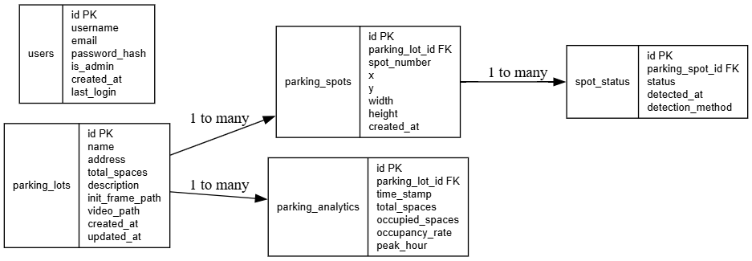
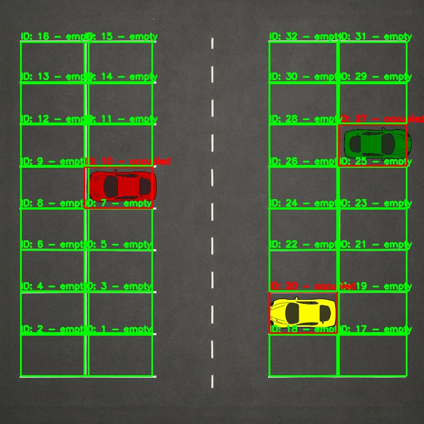

# ParkVision

**Team Members**: Justin Alega, Brant Bremer, Benjamin Biehl, Aaron Dubale, Cooper Wooley

## Problem Statement

Parking inefficiency leads to congestion, wasted time, and frustration for drivers, especially in high-traffic zones. Existing solutions often rely on costly sensors or manual monitoring methods. ParkVision proposes a scalable, computer-vision-based approach to track real-time parking availability using video feeds and intelligent analytics.

## Proposed Solution

ParkVision leverages computer vision and backend infrastructure to deliver a real-time smart parking management system. It detects parked vehicles from live or recorded camera feeds and maps them onto a top-down lot view using homography transformation. A web-based dashboard (in development) will display real-time availability to:

- Help drivers locate open spaces
- Enable administrators to monitor lot occupancy
- Provide insights for universities, businesses, or municipalities

## Current Features

### Backend (Python, Flask, OpenCV)

- **Video Processing & Computer Vision**:
  - Automatic detection of parking spaces via edge detection
  - Vehicle presence detection using background subtraction
  - Cropping and reference image generation for consistent processing

- **Database (PostgreSQL)**:
  - Stores parking lot metadata, parking spot definitions, status updates, analytics, and optional user access management

- **REST API Endpoints** *(See below for future additions)*:
  - Initialize new parking lots and spots
  - Fetch current occupancy data

- **Dockerized Deployment**:
  - Easily spin up the backend and server using Docker

### Data Schema Highlights

```sql
Tables:
- parking_lots
- parking_spots
- spot_status
- parking_analytics
- users (optional for admin/auth)
```



### Computer Vision Overview

Key utilities used in parking detection:
- `detect_parking_spaces_auto(video_path, sensitivity=75)`: Detects all parking spaces in a frame using Canny edge detection

- `detect_cars_background_subtraction(frame, lot_id)`: Identifies whether spaces are occupied using background subtraction

- `capture_reference_image(video_path, frame_number=0)`: Captures and stores a stable frame from video as a reference image

- `remove_black_bars(frame)`: Cleans video feed frames by removing black borders for better edge detection

Key utilities for data processing:
- `normalize(spots)`: Takes all spots in a lot and normalizes them to have the same bounding area, and x and y coordinates that are more ideal



### API Routes

- `GET /initialize_lot`: Load HTML form or interface for initializing lots

- `POST /initialize_lot`: Process and save a new lot configuration

    - **Request Body (JSON):**
        ```json
        {
        "video_path": "path/to/video.mp4",
        "name": "Lot A",
        "description": "Near Engineering Hall",
        "address": "123 Main St"
        }
        ```
    - **Response**
        ```json
        { 
        "lot_id": 1,
        "spots": [
            {
            "id": 1,
            "x": 100,
            "y": 150,
            "width": 50,
            "height": 80,
            "status": "empty"
            },
        ]
        }
        ```

- `GET /lot_status/<lot_id>`: Return current occupancy status of all spots in a given lot

### Running with Docker

Instructions for building and running the Docker container

**Start Services**

From inside `parking-system` run: 
```bash
docker-compose up --build
```
Note: use `podman-compose` if podman is your Docker engine

You may also have to remove your docker/podman container network firewall. To do this open the conflist file: `nano ~/.config/cni/net.d/parking-system_default.conflist` and remove the entire `type: firewall` block.

### Frontend

The frontend dashboard is under development. Placehold for future updates.

### Analytics Support

The `parking_analytics` table is designed to provide insights into:

- Placeholder

### Future Work

- Complete frontend UI with visual lot overlays and occupancy statistics
- Authentication system for admin panel access
- Real-time feed updates (live video)
- Better parking lot configurability (frontend definitions during initialization, warped camera angles, etc.)
- Improved car detection (maybe using deep learning)