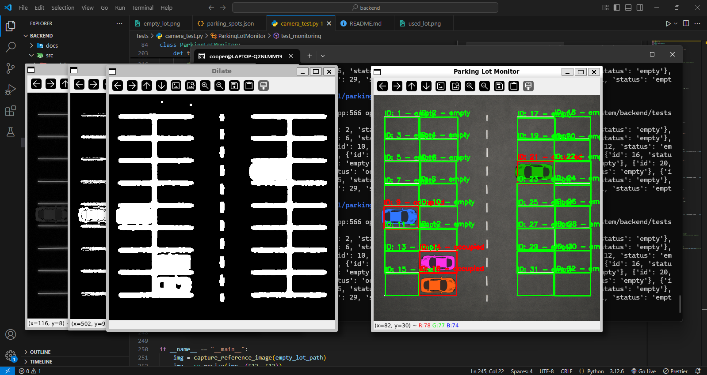

# Running Test Code

## Setup

Please install the requirements before you proceed! (Current requirements.txt needs work)

If you are on debian/ubuntu (I am using WSL for this project) `sudo apt update`, `sudo apt install libgl1` and `sudo apt install -y libxcb-xinerama0 libxkbcommon-x11-0 libxcb1 libxcb-util1 libxcb-image0 libxcb-keysyms1 libxcb-render-util0 libgl1 libglib2.0-0 libsm6 libxrender1 libxext6`

Install OpenCV `pip install opencv-python`

## Running

Currently expected to run from backend `cd parking-system/backend`

Run using `python3 src/tests/camera_test.py`

**IMPORTANT**: For the full effect, for the first run uncomment `# define_parking_spaces(img)` in `main()`. This will have you manually define each parking spot (top left corner, bottom right corner) and create a corresponding json file. To exit, press any key on your keyboard

Currently the only detection method that has been optimized to work is `detect_cars_background_subtraction()` (see image). Very simply, this takes the empty parking lot and the used parking lot images, grayscales them, creates a vector diff image of the two, applies a threshold to the image (value above x will be white, below black) and then dilates (fills in holes) the image. If the space within a defined parking spot is greater than 50%, we define that as there being a car and mark the spot as occupied. You can play around with the other methods by uncommenting them in `test_monitoring()`.

To show the "Parking Lot Monitor" press any key on your keyboard. To exit the "Parking Lot Monitor" and program, simply press `q`.

# Future Goals

Transformations (Homography) to allow for skewed camera angles / distorted lenses to still have a proper overhead view of a lot

Automatic parking spot detection (currently manual)

For testing sakes, clean up of file paths. Also, for some functions, it would be easier to actually pass the image as the parameter rather than the path and vice versa